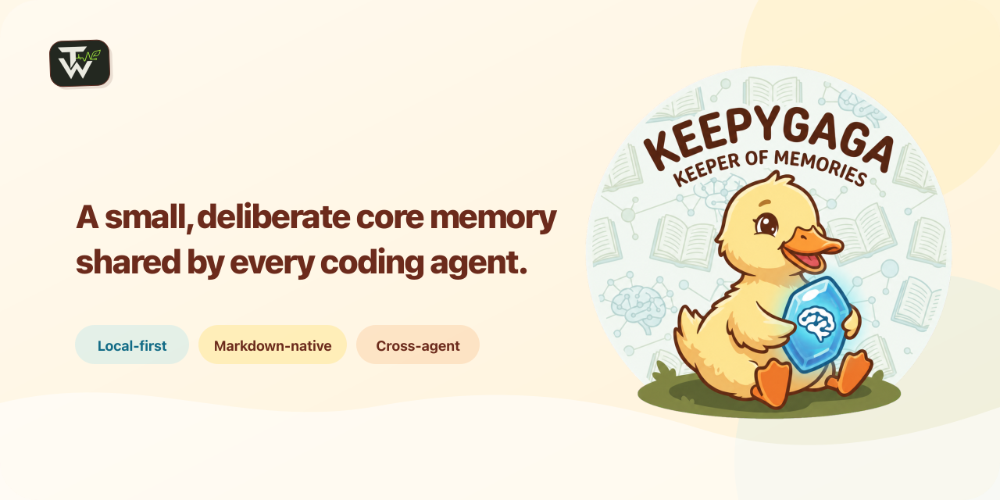

# Keepygaga

<p align="center">
  
</p>

[English](README.md) | [简体中文](README.zh-CN.md)

**A small, deliberate core memory shared by every coding agent.**

AI agents do not get better by remembering everything. If every conversation, temporary state, and project detail is pushed into long-term memory, useful facts are buried under stale and irrelevant context. Memory without selection is noise.

Keepygaga keeps only a small set of durable facts that remain useful across tasks: who the user is, how they want an Agent to work, and a few ongoing topics, projects, responsibilities, or relationships. Temporary state stays in the current conversation or its direct source, such as a calendar, task manager, project documentation, issue tracker, or Git history. A fact enters core memory only when it has been deliberately judged useful across tasks.

That carefully selected core memory belongs to the user and follows them across Codex, Claude Code, WorkBuddy, Grok, Hermes, and Antigravity CLI instead of being trapped in separate host silos. Its source of truth is readable Markdown in one private Memory Root, preferably inside an Obsidian vault; any Markdown editor remains compatible.

The product has three deliberately separate surfaces:

- **Obsidian or another Markdown editor** is where people inspect, correct, and organize memory.
- **MCP, Hooks, and the Agent Contract** let agents read and update that memory under explicit constraints.
- **The `keepygaga` CLI** is a thin installation and operations control plane for host wiring, status, diagnostics, repair, upgrades, and uninstall. It is not a daily memory browser or editor.

Keepygaga ships the complete runtime: an eight-tool MCP server, a concise global Agent Contract, built-in cross-host Hooks, and the CLI control plane. It does not require a database, embeddings, a source checkout, or an external Hook runtime. Obsidian is the recommended human interface, not a runtime dependency.

Core memory contains `profile.md`, `preferences.md`, and direct pages below `topics/`, `areas/`, and `people/`. Ongoing projects share one canonical index at `areas/projects.md`: one Fact per project holds a brief, its canonical Authority, and optionally its latest completed major milestone, with later changes replacing that Fact. Complete history, terminology, architecture, operating guides, decisions, and current state remain in the repository or another direct project source.

Host-native memories can continue to own host-specific conversation recall and project learning. Keepygaga owns the small set of stable user facts that should follow the user across hosts.

The public MCP surface is exactly `list`, `read`, `create`, `add`, `update`, `move`, `rename`, and `delete`.

Session bootstrap injects only `profile.md`, `preferences.md`, and descriptions of the three dynamic scopes. Agents call `list` for one of `topics`, `areas`, or `people` when they need page metadata. New or semantically updated Facts receive a Store-owned local date suffix; existing undated Facts remain readable and upgrades do not rewrite the Memory Root.

Contract 3 users with existing project pages should follow the [project-index migration](docs/operations.md#contract-3-project-index-migration) before the first Contract 4 project-memory write.

## Install

Requirements: Python 3.12+ and [`uv`](https://docs.astral.sh/uv/).

### Agent-guided installation (recommended)

Give the Agent host you are currently using this one sentence:

> Install Keepygaga for the Agent you are running in now from the latest official Release at https://github.com/TimWongUp/keepygaga, follow its Agent Install To-do through initialization and verification, ask me whether each existing global Profile or Preference should move to Keepygaga or remain in its effective rules file, and leave no duplicate injection.

The [Agent Install To-do](docs/agent-install.md) is the authoritative procedure for this path. It limits activation to the current Agent, preserves existing data, makes the Home Page source choice explicit, and leaves host-native memory configuration to the user through current official host documentation.

### Manual installation

Download the `keepygaga-X.Y.Z-py3-none-any.whl` asset from the [latest GitHub Release](https://github.com/TimWongUp/keepygaga/releases/latest), replace `X.Y.Z` below with that release version, then run:

```shell
uv tool install ./keepygaga-X.Y.Z-py3-none-any.whl
uv tool update-shell
```

Restart the terminal so the tool directory is on `PATH`, then run `keepygaga install`.

Interactive installation first offers a Memory Root path, then detects available hosts without selecting them on the user's behalf. Point it at an existing `agents-memory` tree to connect another Agent to the same memory. Once configured, later installs reuse that root automatically. Automation must name every target explicitly:

```shell
keepygaga install --yes --host codex --host claude-code
```

Supported adapters are Codex, Claude Code, WorkBuddy, Grok, Hermes, and Antigravity CLI. Each adapter manages only its `keepygaga` MCP registration, the Keepygaga-owned Agent Contract block, and Keepygaga-owned Hook entries. Unrelated host configuration is preserved.

The default configuration and memory paths are platform-native. To reuse an existing private memory tree non-interactively, pass `--memory-root` during the first install. Do not place the memory tree in a public or automatically published directory.

New installations include five optional memory-capacity settings with the current defaults and adjustment notes. Existing configuration files are never rewritten. Edit the live `config.toml`; the next MCP call reloads these Store-only limits without requiring a schema refresh:

```toml
[memory.limits]
# Raise for richer profile/preferences; lower to reduce baseline context.
fixed_page_chars = 2000
# Raise for fewer, larger routed pages; lower to encourage earlier splitting.
dynamic_page_chars = 5000
# Raise to allow more topic pages; lowering never deletes existing pages.
topics_pages = 50
# Raise to allow more area pages; lowering never deletes existing pages.
areas_pages = 50
# Raise to allow more people pages; lowering never deletes existing pages.
people_pages = 100
```

Every value must be a positive integer. Lower limits report existing excess through Doctor and constrain later growth; they do not delete or rewrite memory. The bounded repair input is derived as twice `dynamic_page_chars`.

## Operate

```shell
keepygaga status
keepygaga repair --yes
keepygaga doctor --json
keepygaga uninstall --yes
```

`status` treats the install-state file as discovery data only and reports when live host verification is still required. `repair` reconciles recorded hosts from their current configuration. `uninstall` removes only Keepygaga host wiring; it preserves the configuration and memory tree.

To upgrade, download the newer wheel, run `uv tool install --force ./keepygaga-X.Y.Z-py3-none-any.whl`, then run `keepygaga repair --yes` to reconcile host wiring.

Advanced deterministic host commands remain available as `keepygaga host setup|uninstall HOST`.

## How integration works

- `keepygaga-mcp` is the stable MCP launcher used by host registrations.
- The short managed Agent Contract contains only durable safety and routing rules.
- The full read, convergence, mutation, conflict, and receipt protocol is delivered through negotiated MCP server instructions (modern discovery or the legacy initialize handshake).
- Built-in Context Bootstrap, Memory Route, and Memory Closeout Hooks are projected into each host's native event schema.
- Application, Agent Contract, Hook protocol, installer state, and memory schema versions evolve independently.

Configuration-level tests prove projection, preservation, idempotency, and failure boundaries. A host is live-verified only after its real client or official diagnostic confirms the `keepygaga` registration and all eight tools.

## Development

```shell
uv sync
uv run pytest -q
uv run ruff check .
uv run pyright
uv run python scripts/smoke_mcp_server.py
uv build
uv run python scripts/check_distribution.py dist/*
```

The `keepygaga-knowledge` sibling project is separate and is neither packaged nor imported by Keepygaga. See [Architecture](docs/architecture.md), [Operations](docs/operations.md), and [Contributing](CONTRIBUTING.md).

## Security and license

Memory files are trusted local input and may contain personal data. Keep the memory root private, review changes before committing them anywhere, and report vulnerabilities through [GitHub private vulnerability reporting](https://github.com/TimWongUp/keepygaga/security/advisories/new).

MIT licensed. See [LICENSE](LICENSE).
