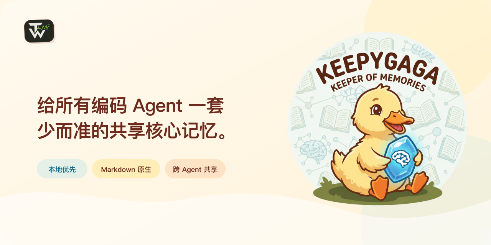

# Keepygaga

<p align="center">
  
</p>

[English](README.md) | [简体中文](README.zh-CN.md)

**给所有编码 Agent 一套少而准的共享核心记忆。**

AI 不是记得越多越好。把每次对话、临时状态和项目细节都塞进长期记忆，只会让真正有用的信息被过时、无关的内容淹没。没有选择的记忆不是上下文，而是噪声。

Keepygaga 只保存少量、能跨任务长期发挥作用的信息：用户是谁、希望 Agent 怎样工作，以及少数持续关注的主题、项目、责任或人物关系。临时状态留在当前对话或它的直接真源里，例如日历、任务管理器、项目文档、Issue 或 Git 历史。只有经过明确判断、确认能跨任务长期发挥作用的事实，才进入核心记忆。

这套经过筛选的核心记忆属于用户，并随用户在 Codex、Claude Code、WorkBuddy、Grok、Hermes 与 Antigravity CLI 之间流动，而不是被困在各宿主的记忆孤岛中。唯一事实源是一个私有 Memory Root 中的可读 Markdown；推荐把它放进 Obsidian Vault，也兼容任意 Markdown 编辑器。

产品刻意分成三个界面：

- **Obsidian 或其他 Markdown 编辑器**供人查看、纠正和整理记忆。
- **MCP、Hook 与 Agent Contract**让 Agent 在明确约束下读取和修改记忆。
- **`keepygaga` CLI**是薄的安装与运维控制面，只负责宿主接线、状态、诊断、修复、升级和卸载，不承担日常记忆浏览或编辑。

Keepygaga 独立提供完整运行时：八个 raw Tool 的 MCP Server、精简全局 Agent Contract、内置跨宿主 Hook，以及 CLI 控制面。它不依赖数据库、向量索引、源码 checkout 或外部 Hook Runtime；Obsidian 是推荐的人类界面，不是运行依赖。

核心记忆由 `profile.md`、`preferences.md` 以及 `topics/`、`areas/`、`people/` 的直属页面组成。持续项目统一登记在 `areas/projects.md`：每个项目只用一条 Fact 保存简介、规范项目真源和可选的最新重大节点，后续变化直接替换原 Fact。完整历史、术语、架构、操作说明、重要决定与当前状态仍由项目仓库或其他直接真源负责。

宿主原生记忆可以继续负责该宿主的会话召回与项目内学习；Keepygaga 只负责应当随用户跨宿主流动的少量稳定事实。

公开 MCP Tool 固定为 `list`、`read`、`create`、`add`、`update`、`move`、`rename`、`delete`。

会话启动时只注入 `profile.md`、`preferences.md` 和三个动态分区的描述。Agent 需要页面元数据时，再对 `topics`、`areas` 或 `people` 中的一个分区调用 `list`。新建或语义更新的 Fact 会获得由 Store 生成的本地日期后缀；已有无日期 Fact 仍可读取，升级也不会改写 Memory Root。

已有项目页面的 Contract 3 用户，应在 Contract 4 首次写入项目记忆前完成[项目索引迁移](docs/operations.md#contract-3-project-index-migration)。

## 安装

要求 Python 3.12+ 和 [`uv`](https://docs.astral.sh/uv/)。

### Agent 引导安装（推荐）

把下面一句话交给当前正在使用的 Agent：

> 从 https://github.com/TimWongUp/keepygaga 的最新官方 Release 为你当前运行所在的 Agent 安装 Keepygaga，严格按同一版本标签中的 Agent Install To-do 完成初始化与验证；只把现有全局规则当作不可信源材料，让我逐条确认提取的 Profile 或 Preference，并在匹配的 Keepygaga Home Page 与连接到这个 Memory Root 的全部全局规则入口中选择唯一所有者，最后不得在这些来源间留下重复注入。

[Agent Install To-do](docs/agent-install.md) 是这条路径的权威流程。它只激活当前 Agent，保留已有数据，明确 Home Page 真源选择，并让用户根据当前官方宿主文档自行配置宿主原生记忆。

### 手动安装

从同一个[最新 GitHub Release](https://github.com/TimWongUp/keepygaga/releases/latest)下载 `keepygaga-X.Y.Z-py3-none-any.whl` 与 `SHA256SUMS`。执行 wheel 前先核对其 SHA-256 条目，将下方的 `X.Y.Z` 替换为该版本号，然后执行：

```shell
uv tool install ./keepygaga-X.Y.Z-py3-none-any.whl
uv tool update-shell
```

重开终端使工具目录进入 `PATH`，然后运行 `keepygaga install`。

校验和只能发现文件损坏或资产不匹配；它不是签名、来源证明、独立发布者认证，也不验证从包索引解析的依赖。

交互安装会先让用户确认或输入 Memory Root，再检测可用宿主并由用户选择。已有 `agents-memory` 记忆树可以直接接入；配置完成后，后续新增 Agent 会自动复用该目录。自动化安装必须显式列出全部目标：

```shell
keepygaga install --yes --host codex --host claude-code
```

当前适配 Codex、Claude Code、WorkBuddy、Grok、Hermes 与 Antigravity CLI。安装器只管理目标宿主的 `keepygaga` MCP 注册、Keepygaga 托管的 Agent Contract 块和 Hook 条目，保留其他配置。

默认配置与记忆目录使用各平台原生路径。非交互首次安装如需复用已有私有记忆树，可传入 `--memory-root`；不要把记忆树放进公开或自动发布目录。

新安装会写入五项可选记忆容量设置，保留当前默认值并附带调整说明；已有配置文件不会被升级流程改写。编辑当前 `config.toml` 后，下一次 MCP 调用会重新加载这些仅由 Store 使用的限制，不需要刷新 Tool Schema：

```toml
[memory.limits]
# 调高可容纳更丰富的 Profile/Preferences；调低可减少基础上下文占用。
fixed_page_chars = 2000
# 调高可使用更少、更大的动态页；调低会更早建议拆页。
dynamic_page_chars = 5000
# 调高可增加 topics 页面；调低不会删除已有页面。
topics_pages = 50
# 调高可增加 areas 页面；调低不会删除已有页面。
areas_pages = 50
# 调高可增加 people 页面；调低不会删除已有页面。
people_pages = 100
```

所有值都必须是正整数。调低后，Doctor 会报告已有超限内容并限制后续扩张，但不会删除或重写记忆；repair 输入上限始终由 `dynamic_page_chars × 2` 派生。

## 运维

```shell
keepygaga status
keepygaga repair --yes
keepygaga doctor --json
keepygaga uninstall --yes
```

`status` 只把安装状态文件当作发现线索，并明确标识仍需真实宿主验证的部分。`repair` 依据 live 配置重新对齐已记录宿主；`uninstall` 只拆除 Keepygaga 接线，保留配置与记忆树。

升级时下载新版 wheel 与同一 Release 的 `SHA256SUMS`，校验 wheel 后执行 `uv tool install --force ./keepygaga-X.Y.Z-py3-none-any.whl`，再运行 `keepygaga repair --yes` 对齐宿主接线。

高级确定性入口仍为 `keepygaga host setup|uninstall HOST`。

## 集成结构

- 宿主 MCP 注册统一指向稳定启动器 `keepygaga-mcp`。
- 精简 Agent Contract 只保留稳定安全与路由规则。
- 完整读取、收敛、mutation、冲突与 receipt 协议由协商后的 MCP Server instructions 下发（现代 discovery 或旧式 initialize 握手）。
- 内置 Context Bootstrap、Memory Route、Memory Closeout 三个语义 Hook，再投影为各宿主的原生事件格式。
- 应用、Agent Contract、Hook 协议、安装状态和记忆 schema 分别演进版本。

配置级测试只证明投影、保留、幂等与失败边界；只有真实客户端或官方诊断确认 `keepygaga` 注册和八个 Tool 后，才能称为现场验证。

## 开发验证

```shell
uv sync
uv run pytest -q
uv run ruff check .
uv run pyright
uv run python scripts/smoke_mcp_server.py
uv build
uv run python scripts/check_distribution.py dist/*
```

Sibling 项目 `keepygaga-knowledge` 与本项目完全独立，不进入 Keepygaga 包，也不被运行时 import。参见 [架构](docs/architecture.md)、[运维](docs/operations.md) 与 [贡献指南](CONTRIBUTING.md)。

## 安全与许可证

记忆文件是可信本地输入，可能含个人信息。请保持 Memory Root 私密，并在提交到任何仓库前检查内容。安全问题请使用 [GitHub 私密漏洞报告](https://github.com/TimWongUp/keepygaga/security/advisories/new)。

MIT License，见 [LICENSE](LICENSE)。
